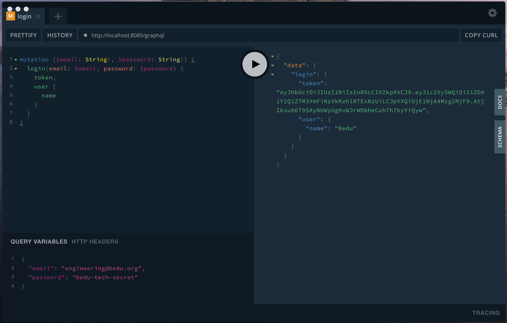
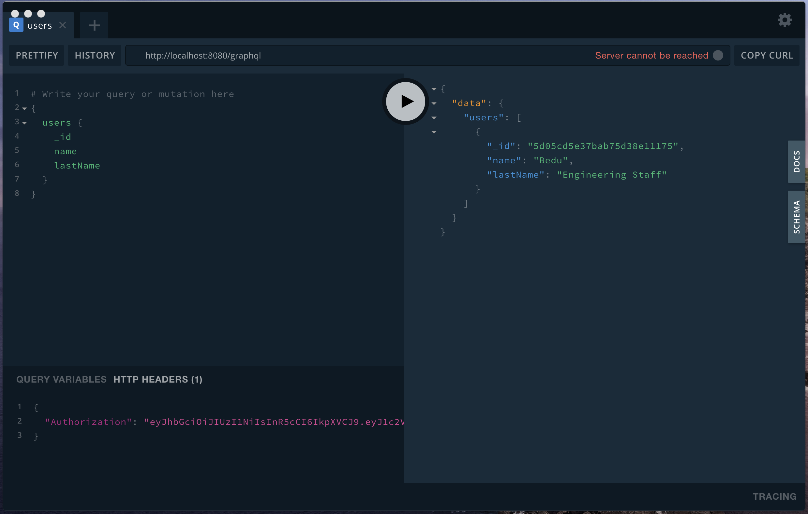
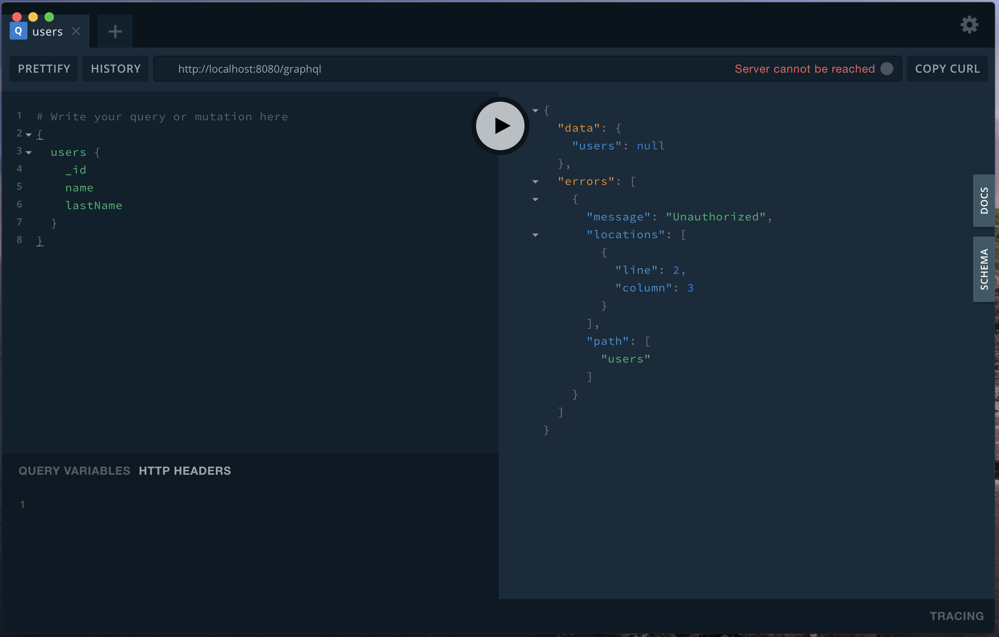

##### EJEMPLO 05
## USANDO CONTEXT PARA PROTEGER ACCIONES EN GRAPHQL

### OBJETIVO
Proteger las mutaciones y queries que requieren autorización utilizando JWT (JSON Web Tokens).

### REQUERIMIENTOS
1. Proyecto con GraphQL API. [Ejemplo 01](Ejemplo-01).
2. Mongo 4 o superior. [Download](https://www.mongodb.com/download-center/community).

### DESARROLLO
Para poder lograr el objetivo, primero debemos entender un poco sobre como funciona el contexto, el Contexto o `context` es la ubicación donde podemos almacenar valores globales a los cuales cualquier `resolver` puede acceder. El `context` es un buen lugar para almacenar información sobre autenticación, detalles de base de datos, cache y cualquier otra cosa que se necesite en GraphQL.

Por esta razón, dentro de nuestro archivo `src/index.js` en la línea 20 agregaremos el contexto de GraphQL, aquí es donde añadiremos nuestra lógica para determinar que hacer para llevar acabo el proceso de autorización.
```js
// Added schema definitions and resolvers
const server = new ApolloServer({
  typeDefs: schema,
  resolvers,
});
```

Ahora, vamos a consumir el Query de `users` para obtener los usuarios registrados. Pero este Query, solo lo deberían consumir usuarios autorizados, es por ello que será necesario primeramente iniciar sesión a través de la mutación `login` y obtendremos un JWT token. 



Ahora, este token generado lo enviaremos a través de un `Header` dentro de la petición HTTP. Así que, dentro de la sección de HTTP Headers vamos a enviarlo al Query de `users`.



De esta manera, podremos observar que el Query nos resuelve correctamente la información, pero esto no significa que ya estemos protegidos, ya que hasta el momento, solo hemos enviado el token, pero no hemos verificado que este sea válido.

Para lograr verificar primeramente, vamos a obtener el `Header` desde la petición enviada al servicio de GraphQL y posteriormente, usaremos la librería de `jsonwebtoken` que utilizamos para firmar dichos tokens, ahora para validar que sean nuestros tokenes generados.

Esto lo obtendremos desde la petición osea el `request` recibido a través de Express, para ello, haremos una modificaciones dentro de nuestro contexto.
```js
// Added schema definitions and resolvers
const server = new ApolloServer({
  typeDefs: schema,
  resolvers,
  context: async ({ req }) => {
    let currentUser;
    const token = req.headers.authorization;
    if (token) {
      currentUser = jwt.verify(token, APP_JWT_SECRET);
    }
    return { ...req, currentUser };
  },
});
```

En el código anterior, utilizamos `req.headers.authorization` para acceder al objeto de `headers` dentro de `req` y así obtener el `Authorization` header, en donde estamos enviando nuestro token. Posteriormente, verificamos si nos han enviado el token, si esto fue así procedemos a validarlos a través de `jsonwebtoken`, en caso contrario, si no encontramos un token, simplemente enviamos un `currentUser` sin definir para más adelante validar si es que existe un usuario autenticado.

Ahora, una vez ya recibimos nuestro token y agregamos al usuario autenticado al contexto, entonces es hora de proteger nuestras rutas. Primero, protegeremos el Query de `users`, este lo podremos encontrar dentro del archivo `src/resolvers/query.js`.
```js
import User from '../models/User';

const Query = {
  status: () => 'Welcome to GraphQL',
  users: () => {
    return User.find().exec();
  },
};

export default Query;
```

Lo primero que haremos será acceder al contexto para obtener los datos que hemos propagado a través de el.
```js
import User from '../models/User';

const Query = {
  status: () => 'Welcome to GraphQL',
  users: (_, args, context) => {
    return User.find().exec();
  },
};

export default Query;
```

De esta manera podemos acceder al contexto, pero nosotros lo haremos usando la técnica de destructuring de ES6, para solo obtener la variable que necesitamos, en este caso `currentUser`.
```js
import User from '../models/User';

const Query = {
  status: () => 'Welcome to GraphQL',
  users: (_, args, { currentUser }) => {
    return User.find().exec();
  },
};

export default Query;
```

Una vez que obtuvimos nuestro supuesto usuario autorizado, vamos a verificar si que existe. Y en caso de que no exista, vamos a enviar un error de no autorizado.
```js
import User from '../models/User';

const Query = {
  status: () => 'Welcome to GraphQL',
  users: (_, args, { currentUser }) => {
    if(!currentUser) {
      throw new Error('Unauthorized');
    } 
    return User.find().exec();
  },
};

export default Query;
```

Ahora hagamos la prueba primeramente sin enviar el header de autorización.



Ahora usando un token para un usuario autorizado.


